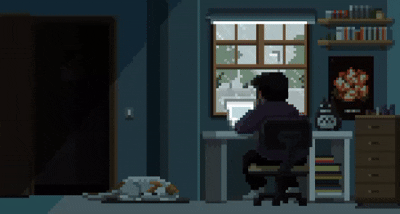
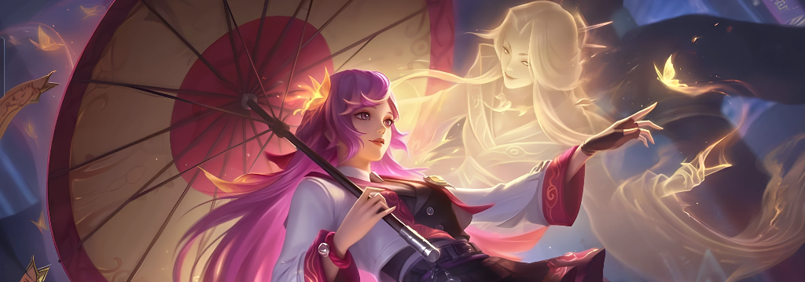

  
  
   

  <h1 align="center">M. Sambasivarao</h1>
  
  <h3 align="center">UI Engineer | Frontend Developer</h3>
  
  

    
  

 

<table align="center" border="0" width="100%">
  <tr>
    <td width="45%" align="center">
      
    </td>
    <td width="55%" valign="middle">
      <h3>👨‍💻 The Code Weaver</h3>
      

        I am a <b>Pixel Perfectionist</b> currently pivoting from ECE to the world of Full Stack Development.
          
        I don't just write code; I craft experiences. My mission is to bridge the gap between <b>aesthetic design</b> and <b>robust engineering</b>.
          
        <b>Mantra:</b> Learn. Implement. Build.
      

    </td>
  </tr>
</table>

 

  

  <h3>🎮 The Gaming Persona</h3>
  

    When the server crashes, I head to the Land of Dawn.
     
    <b>Main Game:</b> Mobile Legends: Bang Bang (MLBB)
     
    <b>Roles:</b> Mage / Support / Tank
     
    <i>"A good Roamer saves the carry. A great Roamer carries the game."</i>
  

 

<table align="center" width="100%" border="0">
  <tr>
    <td width="40%" align="center">
      
    </td>
    <td width="60%" align="left" valign="middle">
      <blockquote>
         
        "I type at 100 WPM, but I debug at 1 line per hour."
          
        <i>— The Reality of Frontend Development</i>
      </blockquote>
    </td>
  </tr>
</table>

   
  <h3>🛠️ Tech Arsenal</h3>
  
    
  

